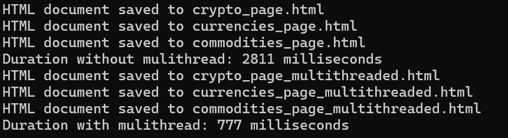

# Multi-threaded Web Scraper in C++

This project is a multi-threaded web scraper implemented in C++. The scraper fetches HTML content from multiple web pages asynchronously, improving efficiency and reducing overall runtime.

## Table of Contents

- [Features](#features)
- [Technologies Used](#technologies-used)
- [Getting Started](#getting-started)
- [Usage](#usage)
- [Concurrency Explained](#concurrency-explained)
- [CURL Library](#curl-library)
- [Results](#results)

## Features

- Asynchronously scrape multiple web pages using C++ threads.
- Save the fetched HTML content to local files.
- Efficiently handles network requests without blocking the main thread.

## Technologies Used

- C++
- `libcurl` for making HTTP requests
- `std::async` for asynchronous threading
- CMake for build configuration

## Getting Started

To get started with this project, follow these steps:

1. **Clone the repository**:
   ```bash
   git clone https://github.com/yourusername/multi-threaded-web-scraper.git
   cd multi-threaded-web-scraper
    ```

2. **Install dependencies**:
    ```bash
    sudo apt-get install libcurl4-openssl-dev
    ```

3. **Build the project** :
    ```bash
    mkdir build
    cd build
    cmake ..
    make
    ```

4. **Run the scraper**:
    ```bash
    ./Cpp-webscraper
    ```

5. **Usage**:
The web scraper can fetch data from multiple URLs. You can modify the main.cpp file to add or change the URLs you want to scrape.
    ```cpp
    std::string crypto_page = scrapper.get_request("https://sg.finance.yahoo.com/crypto/");
    std::string currencies_page = scrapper.get_request("https://sg.finance.yahoo.com/topic/currencies/");
    std::string commodities_page = scrapper.get_request("https://sg.finance.yahoo.com/topic/commodities/");
    ```
The scraped HTML content will be saved to corresponding HTML files in the project directory.

## Concurrency Explained

In general, we work with two types of threads:

- **Synchronous Threads**: These threads block the main thread, requiring it to wait until the synchronous operations are complete before proceeding.

- **Asynchronous Threads**: Unlike synchronous threads, asynchronous threads operate independently of the main thread, allowing it to continue executing without waiting. In this scraper, we opted to implement asynchronous threads to efficiently fetch multiple web pages concurrently. This approach maximizes performance and responsiveness by utilizing the `std::async` function to create threads that return a future object.

    ```cpp
    auto future_crypto = std::async(std::launch::async, &WebScraper::get_request, &scrapper, "https://sg.finance.yahoo.com/crypto/");
    ```

    The `get()` method on the future object serves as a blocking call, which pauses the main thread until the result of the asynchronous operation is available.

## CURL Library

The CURL library is utilized in this project to make HTTP requests. It’s crucial to note that the CURL library is not thread-safe. Therefore, to ensure thread safety, we create a new instance of CURL for each thread. The `get_request_from_new_scraper` function encapsulates this design by initializing a separate WebScraper instance for each asynchronous call.


## Results
The results of our web scraping project highlight a significant performance difference between the single-threaded and multi-threaded approaches. The comparison of execution times is illustrated in the image below:

### Key Observations

#### Execution Time
The multi-threaded approach demonstrated a remarkable reduction in execution time, completing the scraping tasks approximately four times faster than the single-threaded approach. This speedup is substantial and showcases the advantages of concurrent processing in handling multiple HTTP requests simultaneously.

#### Resource Utilization
In the single-threaded approach, each web request is processed sequentially. This means that while the program waits for a response from one request, it is unable to initiate another request, leading to idle time and inefficient use of system resources. Conversely, the multi-threaded approach allows multiple requests to be made in parallel. By utilizing asynchronous threads, we are able to send out multiple HTTP requests at once, significantly reducing the overall wait time associated with network latency.

#### Scalability
The multi-threaded design improves scalability. As the number of URLs to scrape increases, the multi-threaded approach can effectively handle a larger workload without a linear increase in execution time. This makes it a more suitable choice for larger web scraping tasks where speed and efficiency are paramount.

#### Responsiveness
Multi-threading enhances the responsiveness of the application. Users can experience quicker results, as the application can process multiple requests in parallel rather than having to wait for one request to finish before starting the next. This is particularly beneficial in scenarios where timely data retrieval is critical.

### Conclusion
In summary, the multi-threaded approach significantly outperforms the single-threaded method in terms of execution time and resource utilization. The ability to handle multiple HTTP requests concurrently not only accelerates the scraping process but also makes the application more scalable and responsive. As demonstrated by our results, adopting multi-threading for web scraping tasks is a valuable strategy to improve performance and efficiency.
